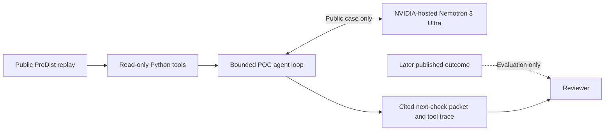
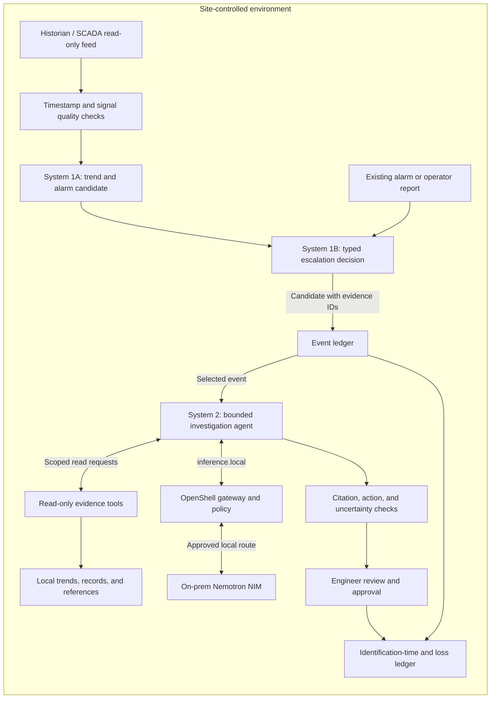

# System 1 / System 2 architecture

Status: design outline, 2026-09-28. Solid descriptions of the current POC and proposed production design are kept separate. The diagrams show logical components, not a claim that the production stack has been deployed.

## Current hackathon POC — implemented

The [saved run](poc/trace-52-nvidia-nemotron-3-ultra-550b-a55b.json) demonstrates hosted Ultra calling three read-only tools on public data. The held-out outcome is not an agent tool. The POC does not continuously ingest a live stream, run NeMo Agent Toolkit, enforce OpenShell policy, or connect to plant controls.

## Target architecture — to test

System 1 continuously processes trends, existing alarms, and operator reports. Stage 1A checks the signal stream and produces an anomaly candidate. A deterministic baseline should be measured before trying a time-series model such as [NVIDIA NV-Tesseract-AD](https://developer.nvidia.com/blog/advancing-anomaly-detection-for-industry-applications-with-nvidia-nv-tesseract-ad/). Stage 1B asks bounded questions about a candidate or report: should it be escalated, does the report conflict with telemetry, is there enough evidence, and how urgent is review? Its output is a typed decision with the asset, time window, quality flags, and source IDs, not a root-cause verdict. An operator report may escalate even when the monitored signal appears normal; the current PreDist case makes this important. Escalation to System 2 is bounded by priority, alert volume, and inference budget.

[TypeSafe AI's Jev](https://typesafe.ai/blog/introducing-system-one-models-and-jev) is a **candidate for Stage 1B** because it answers focused questions with typed choices, scores, and probabilities. A valid output type does not guarantee a correct escalation decision. It does not ingest raw trends or replace a time-series detector. Jev should first be compared with deterministic thresholds and a local model on **licensed public replay data**. The current Jev API is an external service; no on-premises Jev deployment was verified. It is therefore not in the private production path drawn above unless a private deployment and data-handling agreement are separately established. [TypeSafe's privacy policy](https://typesafe.ai/legal/privacy-policy) says input may be processed and retained for the service even though it is not used to train models.

System 2 runs only for a selected event. Nemotron Ultra is the high-capability candidate for public-data experiments. An on-premises Ultra deployment requires appropriate data-center GPU capacity; [NVIDIA describes Ultra as the multi-GPU tier](https://github.com/NVIDIA-NeMo/Nemotron). DGX Spark is a potential site for a smaller local Nemotron tier, not an assumed Ultra host. The agent may consult trends, historical incidents, procedures, and an economics calculator through scoped read-only tools. It emits a cited investigation packet and asks a human to approve any operational action.

## What makes the target secure

| Boundary | Intended control | Evidence still needed |
| --- | --- | --- |
| Plant data | Keep historian, maintenance records, documents, and retrieval index inside the site network. Send only public data to the current hosted trial API. | Inspect the actual tool payload and outbound requests. |
| Agent tools | Expose named read-only queries with asset/time limits. Do not expose equipment-control or arbitrary shell tools to this workflow. | Positive and denied tool-call tests. |
| Runtime | Run System 2 inside a restricted OpenShell sandbox with default-deny egress, scoped filesystem access, and host-side credentials. NVIDIA's [security guide](https://docs.nvidia.com/nemoclaw/user-guide/deepagents/security/best-practices) says inference routes through `inference.local`; the agent does not hold the upstream API key. | A real sandbox run, policy snapshot, and denied egress test. |
| Inference | For private plant data, route to an approved local model endpoint. The hosted Ultra trial is only for licensed public demo data. | Verify chosen model, host, capacity, route, and data policy. |
| Jev decision experiment | Use the external Jev API only with licensed public replay data. Keep proprietary trends and event packets out of it. | Confirm access, payload fields, decision quality, latency, calibration, and deployment terms. |
| Output | Require source IDs for claims, flag undefined signals, distinguish observed data from hypotheses, and keep actions behind engineer approval. | Automated citation/action checks plus expert review. |
| Audit | Record event time, model/version, tool calls, source IDs, policy decisions, human decision, and eventual outcome without copying confidential text into public logs. | End-to-end trace review and retention policy. |

For the planned security test, choose NemoClaw's **Restricted** policy tier, decline web-search and messaging presets, permit only the scoped evidence endpoint and managed local inference route, and inspect the **effective** policy after startup. Exclude any baseline hosted-inference egress that remains available for the selected agent. NVIDIA's [network-policy guide](https://docs.nvidia.com/nemoclaw/latest/user-guide/openclaw/reference/network-policies) notes that the default Balanced tier enables broader package and web presets and that baseline rules remain under Restricted unless explicitly excluded. A sandbox with broad egress would not establish the private-data boundary this design requires. The test should prove a legitimate read succeeds while direct external inference and an unlisted destination are denied. This is a test plan, not an enforcement result.

NVIDIA's [industrial-alarm reference architecture](https://developer.nvidia.com/blog/building-an-analysis-ai-agent-for-industrial-alarm-management-with-nvidia-nemotron/) combines a per-alarm evidence agent, specialist tools, NeMo Agent Toolkit, and OpenShell. Our proposed distinction is a measured **System 1 → System 2 escalation** tied to identification time and an explicit plant-economics value ledger. We should demonstrate that distinction rather than claim originality from the generic per-alarm agent pattern.

## Economic measurement boundary

The local Plant Economics Bench separates **macro opportunity** from **micro identification time**. This hackathon architecture would record `anomaly/alert time → first correct identification → preparation → physical recovery`, together with whether output was actually constrained. Those observations can later inform the macro model's `T_I` and recoverable MWh calculation. No number from the one-case POC proves annual savings. Private raw TM text, identifiers, and plant trends stay out of this repository and hosted inference.
