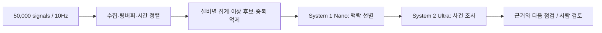

# 처리량 모델: 50,000개 신호 × 100ms

2026-09-28. 사용자가 제시한 설계 부하를 계산한 문서다. 전체 발전소의 보편적 수치, 현재 장비에서 측정한 성능, PreDist 원자료의 수집 속도로 해석하지 않는다.

## 1. 원시 입력 규모

모든 신호가 매 0.1초마다 한 번씩 갱신된다고 가정한다.

| 항목 | 계산 | 결과 |
|---|---|---:|
| 신호별 갱신율 | 1 / 0.1초 | 10Hz |
| 초당 관측값 | 50,000 × 10 | 500,000 |
| 분당 관측값 | 500,000 × 60 | 30,000,000 |
| 하루 관측값 | 500,000 × 86,400 | 43,200,000,000 (432억) |
| 값만 8바이트일 때 | 관측값 × 8 | 4MB/s, 345.6GB/day |
| 관측당 값+시각 16바이트일 때 | 관측값 × 16 | 8MB/s, 691.2GB/day |

용량은 십진 단위의 비압축 payload 계산이다. 프로토콜·태그·품질 정보·인덱스·복제 비용은 제외했다. 프레임별 공통 시각, 압축, 변화량 저장을 사용하면 달라진다. 관측값 수를 LLM 토큰 수나 API 요청 수와 동일시하지 않는다.

## 2. 이 규모에서 필요한 역할 분리

B·C는 시계열 처리 코드가 담당한다. 변화율, 기준선 대비 편차, 결측, 지속 시간과 동시 변화 등을 요약한다. Nano는 이 후보와 운전 맥락을 보고 사건을 묶거나 우선순위를 판단하는 후보 기술이다. Ultra는 선별된 사건의 상세 근거를 조회한다.

**원시 데이터를 모두 큰 모델에 보내지 않는 설계의 필요성과, 맥락 선별을 Nano가 규칙보다 잘 수행하는지는 별개의 주장이다.** 전자는 처리량 계산과 부하 시험으로, 후자는 품질·미탐·호출량 비교로 검증한다. 작은 모델도 전처리 없이 50만 관측값/초를 직접 처리한다고 주장하지 않는다.

## 3. 호출 예산 예시 — 전부 설계 가정

| 단계 | 가정 | 계산 결과 |
|---|---|---:|
| 설비 그룹 | 100개 신호씩 500개 그룹 | 500개 |
| 집계 | 그룹별 10초 구간 | 3,000 group-windows/min |
| 전처리 후보 유지율 | 1% | Nano 30 requests/min |
| Nano의 조사 전달 비율 | 후보의 10% | Ultra 3 investigations/min |
| Ultra 모델 요청 | 사건당 2회 | 6 requests/min |

10초 구간은 용량 모델의 예시다. 실제 이상을 판별할 적절한 구간 길이는 설비·신호 특성으로 정해야 한다. 1%와 10%는 측정하지 않았으며 실제 검출 성능을 뒷받침하지 않는다.

비교를 분리해야 한다.

- 집계 구간 모두를 Ultra로 보내면 3,000 × 2 = **6,000 requests/min**이라는 가정치다.
- 같은 전처리 후보를 모두 Ultra로 보내면 30 × 2 = **60 requests/min**이다.
- 전처리 이후 Nano가 10%만 전달하면 **6 requests/min**이다.

앞의 큰 감소에는 전처리 효과가 포함돼 있다. 이를 Nano의 성과로 계산하지 않는다. Nano 자체의 증분 기여는 동일 전처리 이후 60→6이라는 **가정**을 실제 오류·미탐과 함께 검증해야 한다.

사용자가 제공한 계정 한도 40 requests/min에서는 6 requests/min이 산술상 한도 안에 있다. 이것은 GPU 처리량·토큰 예산·응답 지연·서비스 가용성을 보장하지 않는다. 현재 runner는 프로세스당 18 rpm으로 제한한다.

## 4. 현재 Nano도 병목이 될 수 있다

실제 신고 세 건의 로컬 Nano 요청 시간은 6.26–11.50초였다. 동일 조건으로 순차 처리한다고 단순 계산하면 약 **5.2–9.6 requests/min**이며, 위 예시의 30 requests/min보다 낮다.

필요한 동시 처리 슬롯의 산술 모델은 `ceil(요청률 × 요청 시간 / 목표 이용률)`이다. 30/min, 11.5초, 이용률 60%를 넣으면 **10슬롯**이다. 이는 측정된 병렬 성능이나 GPU 10개라는 뜻이 아니다. GPU 공유 시 지연이 늘 수 있고 배치·모델 크기·후보 비율 변경에 따라 달라지므로 실제 부하 시험이 필요하다.

## 5. 수치로 입증할 실험

1. 합성 부하 발생기로 50,000개 태그를 100ms 프레임마다 갱신한다. 이 시험은 데이터 경로의 성능만 측정한다.
2. 60초 준비 후 5분 동안 입력·처리 개수, 누락, p50/p95 지연, 큐 깊이, 메모리 증가를 기록한다. 목표 입력은 1.5억 관측값이며 스트리밍으로 생성해 전체를 메모리에 보관하지 않는다.
3. 전처리 출력 후보 수와 중복 병합 수를 측정한다. 후보 유지율은 결과로 보고하고 목표 비율에 맞춰 임의 조절하지 않는다.
4. 같은 후보를 규칙과 Nano가 평가하고, 검토 필요 사건을 놓치지 않는 조건에서 Ultra 호출량을 비교한다.
5. Nano의 실제 처리량과 대기열 증가를 확인한다. 감당하지 못하면 후보를 더 구조화하거나 모델·배치 전략을 바꿔 다시 시험한다.

합성 부하 시험은 실제 10Hz 고장 검출·현장 유용성 검증을 대신하지 않는다. 현재 PreDist replay는 24시간에 144개 계측인 저빈도 자료이므로 이 차이를 유지한다.
