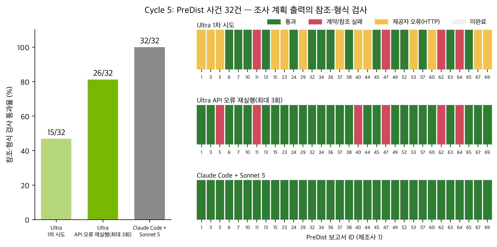
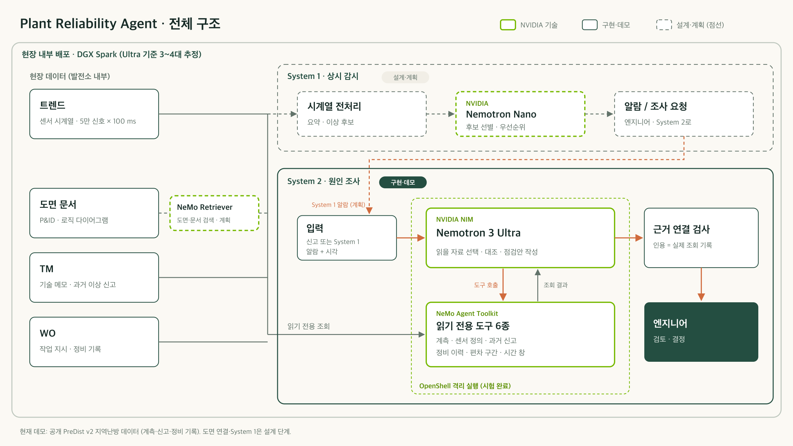

# Plant Reliability Agent

> A locally deployable NVIDIA Nemotron agent that runs the first investigation of a plant equipment report and hands engineers evidence-linked next checks.

**설비 이상 신고가 들어오면, 첫 조사는 에이전트가 먼저.** 관련 계측과 이력을 스스로 골라 읽고, 다음에 확인할 항목을 원본 근거와 함께 엔지니어에게 넘겨줍니다.

**[Live demo](http://juyoung.site/nvidia-hackathon/)** · [발표 슬라이드](submission/slides/Plant_Reliability_Agent_submission.pptx) · [보고서](submission/REPORT.md)

## 한눈에 보기

- **문제**: 발전·열공급 설비의 비계획 정지는 비용이 큽니다. 원인 조사에 필요한 계측, 신고, 정비 이력은 여러 시스템에 흩어져 있고, 보안 요구 때문에 외부 클라우드 AI를 쓰기 어렵습니다.
- **해법**: 현장 안에 배포할 수 있는 NVIDIA Nemotron 기반 에이전트입니다. System 1은 설비를 상시 감시하고(계획), System 2는 신고가 들어오면 필요한 자료를 골라 읽어 원인 조사 점검안을 씁니다(구현).
- **데모**: 공개 지역난방 데이터 PreDist v2의 실제 신고로 System 2 조사를 시연합니다.
- **결과**: 4건 비교 실험에서 근거 연결 검사 통과는 Nemotron 3 Ultra 2/4, 참고 기준인 Claude Code + Sonnet 5는 4/4입니다([상세](evaluation/cycle4/RESULTS.md)).
  - 32건 확장 평가: Sonnet 5 32/32, Nemotron 3 Ultra 15/32 (API 연결 오류 13건 제외 시 15/19, 79%), API 오류 재실행 후 16/32 (모델까지 도달한 21건 중 16건, 76%). 사건당 1회 실행이며 진단 정확도가 아닌 근거 연결 검사입니다. [결과](evaluation/cycle5/RESULTS.md) · 
  - 해석: Sonnet 5는 보안상 현장에서 쓸 수 없는 클라우드 상한선입니다. Ultra가 작성한 점검안 15개는 모두 근거 검사를 통과했고(근거 조작 0건), 격차는 API 오류 13건과 한 가지 도구 실수 4건 같은 실행 안정성에서 나옵니다.

## 데모 보기

가장 빠른 방법은 **[Live demo](http://juyoung.site/nvidia-hackathon/web/)** 입니다.

- [소개 페이지](http://juyoung.site/nvidia-hackathon/web/)
- [조사 데모](http://juyoung.site/nvidia-hackathon/web/system2.html): 점검 항목을 누르면 에이전트가 참고한 원본 기록과 조회 순서가 열립니다. 저장된 실제 실행을 다시 보여주는 화면이라 모델을 새로 호출하지 않습니다.

로컬에서 보려면 Python 3.12 이상만 있으면 됩니다(API 키 불필요).

```sh
python3 scripts/serve_demo.py --port 8771
# http://127.0.0.1:8771/web/ , http://127.0.0.1:8771/web/system2.html
```

## 구조



```text
 설비 계측 ──> [System 1: 상시 감시]  (계획: Nemotron Nano)
                     │ 이상 신고 / 경보
                     v
              [System 2: 원인 조사]  Nemotron 3 Ultra (NIM)
                 │  접수 시각 이전 자료만 조회
                 v
   읽기 도구 6종: 계측 · 센서 정의 · 과거 신고 · 정비 이력 · 시간대별 값 · 편차 구간
                 │  (NeMo Agent Toolkit 등록, OpenShell로 쓰기·외부 연결 차단)
                 v
   점검안: 다음 확인 항목 + 이유 + 원본 기록 연결 + 데이터로 알 수 없는 것
                 │
                 v
             [엔지니어]  검토 후 현장 확인
```

1차측/2차측 유량, 공급온도/실내 온도처럼 헷갈리기 쉬운 구분은 도구 단계에서 처리합니다. 자세한 설계는 [docs/architecture.md](docs/architecture.md)에 있습니다.

| NVIDIA 기술 | 맡은 일 | 상태 | 확인할 곳 |
|---|---|---|---|
| Nemotron 3 Ultra (NIM) | 도구 6종 중 무엇을 읽을지 고르고, 결과를 비교해 구조화된 점검안 작성 | 모든 데모의 핵심 경로 | [docs/architecture.md](docs/architecture.md) |
| NeMo Agent Toolkit 1.8.0 | 읽기 도구 6종 등록·실행 (계획 루프는 자체 Python) | 연동 완료 (`--read-backend nat`) | [NAT 연동](integrations/NAT_LIVE.md) |
| OpenShell 0.1.2 | 허용된 읽기만 통과, 쓰기·외부 연결 차단 | 별도 시험 완료 (전체 경로에는 미적용) | [OpenShell 시험](integrations/openshell-README.md) |
| Nemotron Nano, NeMo Retriever | 상시 감시·재정렬, 문서·도면 검색 | 계획 | [docs/architecture.md](docs/architecture.md) |

## 저장소 구성

| 경로 | 내용 |
|---|---|
| `poc/` | 에이전트 본체: 조사 루프(`live_investigation.py`), 시점별 도구, 근거 연결 규칙 |
| `evaluation/` | 비교 실험 스크립트와 결과 ([32건 평가](evaluation/cycle5/RESULTS.md), [4건 비교](evaluation/cycle4/RESULTS.md), [내용 평가](evaluation/readiness/content-review/v2/CONTENT_RESULTS.md)) |
| `integrations/` | NeMo Agent Toolkit 연동, OpenShell 정책과 실행 기록 |
| `web/` | 정적 데모 화면 (소개, System 2 조사 화면) |
| `data/` | 공개 PreDist v2에서 만든 사건 입력 JSON ([설명](data/README.md)) |
| `submission/` | 보고서, 발표 슬라이드, 제출 안내, 제출 ZIP 빌더 ([SUBMISSION_GUIDE.md](submission/SUBMISSION_GUIDE.md)) |
| `docs/` | 구조 설명, System 1 처리량 계산, 데이터 출처, 준비 과정 메모(`docs/archive/`) ([목차](docs/README.md)) |
| `figures/` | 평가 결과 그림 |
| `tests/` | 데이터·접근 경계·조회 예산·근거 참조 회귀 시험 |
| `scripts/` | 데모 서버, 사건 입력 생성, NVIDIA API 확인 등 보조 스크립트 |

## 재현

```sh
uv sync --locked
uv run python -m unittest discover -s tests -q
```

코드 품질 확인:

```sh
uv run ruff check .
uv run ruff format --check .
uv run vulture poc scripts tests integrations submission evaluation --min-confidence 80
```

**실제 모델로 다시 실행하기.** NVIDIA API 키를 로컬 `.env`에 `NVIDIA_API_KEY=...` 형식으로 넣습니다(`.env`는 git에서 제외되며, 호출은 계정 사용량을 소비합니다).

```sh
uv run python -m poc.live_investigation \
  --case replay-52.json \
  --read-backend direct \
  --handoff-policy bounded_finalize_v2 \
  --output .artifacts/my-live-case52.json
```

`--read-backend nat`로 바꾸면 NeMo Agent Toolkit 경로를 씁니다. 설치와 실행 방법은 [NAT_LIVE.md](integrations/NAT_LIVE.md)에 있습니다. 키가 없어도 저장된 실행 데모는 볼 수 있습니다.

## 데이터와 라이선스

- 설비 데이터: PreDist v2, Fraunhofer IEE / enercity Netz GmbH, [CC BY 4.0](https://zenodo.org/records/19496480).
- 도면 예시: 미국 DOE 공개 증기 계통도. PreDist 설비의 도면이 아닌 독립 예시입니다.
- 회사·고객 데이터와 API 키는 포함하지 않습니다. 현재 사건의 사후 진단은 모델 입력과 데모에서 제외했습니다.

## 한계

- 비교 실험 규모가 작습니다(4건). Ultra 실패 2건은 조회 6회 한도를 모두 써서 결론을 내지 못한 경우로, 한도 도달 시 모은 자료로 정리하도록 고친 뒤(`bounded_finalize_v2`) 사례 52에서만 확인했습니다. 비교 점수는 수정 전 그대로 둡니다.
- 근거 연결 검사는 형식 검사이며 진단 정확도를 보증하지 않습니다. 현장 전문가 평가와 실제 조사 시간 단축은 아직 측정하지 않았습니다.
- System 1 상시 감시, Nemotron Nano, NeMo Retriever는 계획 단계이고, OpenShell은 전체 경로에 아직 적용하지 않았습니다.
