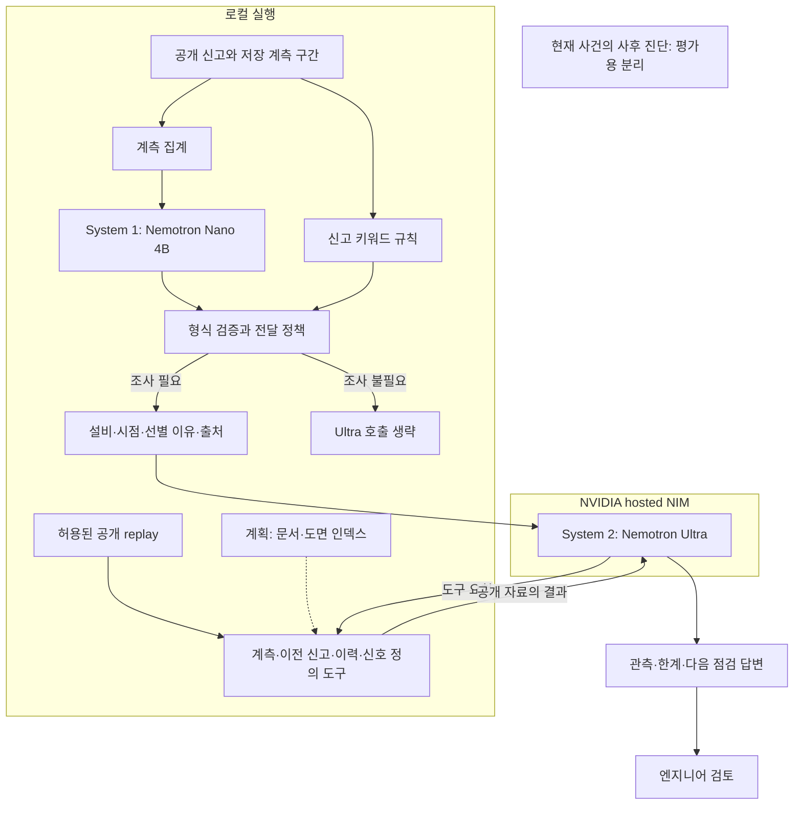

# Plant Reliability Agent
## 공개 에너지 설비 사건의 조사 보조: 설계, 실행 결과, 다음 검증

**검토본 · 2026-09-28 · 임시 서비스명**

> 공개 사건에서 계측과 과거 기록을 조회해, 엔지니어가 검토할 다음 점검을 제안하는 조사 보조 POC다. 실행 가능성은 확인했지만 규칙·고정 요약 대비 효과, 현장 진단 정확도, 식별 시간 단축은 아직 입증하지 않았다.

이 문서를 내용 검토의 기준으로 사용한다. 이전 PDF와 ZIP은 이전 시점의 검토 산출물이며, 마크다운의 내용 합의 전에는 디자인을 다시 다듬거나 재발행하지 않는다.

## 1. 무엇을 해결하려는가

설비 이상을 조사할 때는 신고나 알람이 가리키는 증상과 센서가 측정한 상태를 함께 해석해야 한다. 센서가 설정값을 따랐다는 사실이 사용처에 필요한 열이 전달됐다는 뜻은 아니다. 이전에 무엇을 조정했는지, 현재 확인할 수 없는 신호는 무엇인지도 대조해야 한다.

이번 사례의 질문은 구체적이다.

**“난방이 안 된다는 신고가 있는데 공급온도는 설정값을 따른다면, 다음에 무엇을 확인해야 하는가?”**

제품이 목표로 하는 결과는 원인을 단정하는 문장이 아니라 다음 네 항목을 포함한 조사 자료다.

- **관측:** 어느 설비에서, 어느 시간 구간에 무엇이 측정됐는가.
- **근거:** 그 사실을 확인할 원본 기록은 무엇인가.
- **한계:** 현재 자료만으로 무엇을 판단할 수 없는가.
- **다음 점검:** 어떤 측정이나 기록을 추가로 확보해야 하는가.

장기 적용 대상은 발전소 운전·정비 조사다. 다만 이번 실행 데이터는 **지역난방 서브스테이션 한 곳**이다. 발전소 현장 업무 시간, 수만 개 센서 처리량, 운영자 대비 효과를 측정한 실험은 아니다.

## 2. 현재 제품과 제안 구조를 구분한다

| 구분 | 실제로 실행·제공한 것 | 아직 검증하지 않은 것 |
|---|---|---|
| 사건 선별 | 저장된 신고·계측 집계에 대한 로컬 Nano 판단, 키워드 규칙 비교 | 연속 감시, 이상 검출 성능, 호출량 절감 |
| 근거 조사 | Ultra가 공개 replay 전용 읽기 도구를 호출하고 점검안을 생성 | 점검안의 전문가 평가, 원인 식별 성공률 |
| 시각 자료 | 공개 DOE 계통도의 수동 영역 탐색, 별도 PreDist 계측·기록 표시 | 같은 설비의 도면·계측 통합, 자동 P&ID 인덱싱 |
| NAT | 4개 도구 등록, 3개 도구의 별도 고정 재생 워크플로 실행 | 모델 루프 전체의 NAT 실행 |
| OpenShell | 독립적인 공개 fixture의 허용·차단 정책 시험 | 실제 Nano-Ultra 루프의 격리·통신 정책 검증 |

**DOE 계통도와 PreDist 사건은 서로 다른 자료다.** 둘을 나란히 보여주는 것은 제품 방향을 설명하기 위한 것이며, 같은 설비의 자료가 자동으로 연결됐다는 증거는 아니다.

## 3. System 1 / System 2를 왜 나누었는가

설계 가설은 단순하다. 좁은 질문은 작은 모델이 처리하고, 상세 조사가 필요한 사건만 큰 모델에 전달하면 조사 비용을 줄일 수 있다는 것이다. 그러나 이 가설에는 조건이 있다. 작은 모델이 불필요한 조사를 충분히 줄이면서 중요한 사건을 놓치지 않아야 한다.

현재 실험에서 실제 신고 세 건은 Nano와 키워드 규칙이 모두 조사 대상으로 분류했다. 무신고 파생 시험에서는 Nano가 제공되지 않은 신고를 이유로 조사를 요청했다. **따라서 현재 결과는 Nano를 규칙보다 우선해야 할 근거가 아니다.**

현 단계에서의 권고는 다음과 같다. System 1의 역할 자체는 유지하되, **규칙을 명시적인 기준선으로 두고 Nano를 비교 가능한 실험 분기로 취급한다.** 모델을 두 개 썼다는 사실을 제품 가치로 내세우지 않는다. 이 권고는 후속 구현 방향이며, 이번 검토에서 런타임의 정책을 변경한 것은 아니다.

### 현재 실행 구조

실선은 구현한 호출 관계, 점선은 제안 단계다. 사후 진단은 에이전트 경로에 연결하지 않는다. 이 실행은 실시간 스트림이 아니라 저장된 사건의 재생이다.

### 인터페이스와 한계

Nano는 `escalate`, `priority`, `reason`, `evidence_kinds`를 반환한다. 런타임이 자료형·허용값·일관성을 검사하고, 선택된 근거 종류를 정확한 출처 ID로 연결한다. 첫 실험에서 긴 ID를 잘못 복사한 실패가 있어 이 계약을 도입했다.

이 검증은 **형식**을 검사한다. `reason`이 실제 입력을 뒷받침하는지는 보장하지 않으며, 무신고 시험의 오류가 바로 그 한계를 보여준다. 서비스 중단 신고에 반응하는 규칙은 모델의 보류 판단을 상향할 수 있다. 이 정책의 효과를 Nano의 판단 성능으로 계산하지 않는다.

Ultra에는 네 종류의 읽기 도구를 제공한다. 이번 실제 사건에서는 `get_recent_measurements`와 `get_prior_incidents`를 호출했다. 출력의 미정의 태그를 검사하지만 **모든 사실 문장에 출처가 붙었는지, 그 출처가 문장을 지지하는지까지 검증하지는 못한다.**

구현: [런타임](../poc/run.py) · [사례 52 trace](../poc/trace-52-pipeline.json) · [실패 기록](../poc/runtime-probe-log.json)

## 4. 어떤 자료로 어떻게 시험했는가

[PreDist v2](https://zenodo.org/records/19496480)는 지역난방 설비의 계측과 장애·정비 정보를 제공한다. 그중 M1 서브스테이션 21의 실제 신고 세 건을 선택했다.

| 신고 | 시점 | 신고 전 계측 | 이전 신고 수 | 공급온도–설정값 평균 절대 편차 |
|---|---|---:|---:|---:|
| 52 | 2016-12-12 15:55 | 144 | 1 | 0.31°C |
| 62 | 2019-01-21 08:17 | 144 | 2 | 0.33°C |
| 32 | 2019-10-19 10:38 | 144 | 3 | 0.35°C |

세 건 모두 센서의 공급온도가 설정값을 따르면서 난방 부족이 신고된 사례다. 고장 유형이나 설비 종류의 다양성을 검증하는 표본은 아니다.

현재 사건의 사후 원인·조치를 입력에서 제외하고 계측의 시간 경계를 검사했다. 그러나 이전 보고서의 회고적 조치 서술이 당시 운영자에게 실제로 알려졌는지는 확인할 수 없다. **시간 필터링을 했다는 이유만으로 완전한 실시간 정보 재현이라고 주장하지 않는다.**

별도로 두 파생 시험을 수행했다.

- **무신고 구간:** 실제 공개 계측 구간에 현재 신고를 제공하지 않았다. 정상 상태의 정답 라벨이 있는 것은 아니다.
- **계측 제거:** 사례 52에서 계측을 제거했다. 관측된 고장 사건 추가 건수가 아니라 결측 대응 시험이다.

비교 대상은 동일 replay의 고정 요약과 신고 키워드 규칙이다. 고정 요약은 이 도메인에 맞춘 템플릿으로, 사람이나 범용 LLM의 성능을 대표하지 않는다. 현재 비교는 부품 고장 정답률이나 전문가 평가를 포함하지 않는다.

근거: [데이터 설명](../data/README.md) · [평가 방식](../evaluation/README.md)

## 5. 결과: 실행은 확인됐고, 비교 우위는 확인되지 않았다

| 시험 | Nano / 규칙 판단 | Ultra 도구 호출 | 신고 / 계측 출처 인용 | Nano / Ultra 요청 시간 |
|---|---|---:|---|---:|
| 52 실제 신고 | 조사 / 조사 | 2 | 누락 / 누락 | 6.70 / 22.90초 |
| 62 실제 신고 | 조사 / 조사 | 2 | 있음 / 있음 | 11.50 / 17.29초 |
| 32 실제 신고 | 조사 / 조사 | 2 | 누락 / 있음 | 6.26 / 18.63초 |
| 무신고 파생 | 조사 / 조사 안 함 | 0 | 해당 없음 | 10.09 / 0초 |
| 계측 제거 파생 | 조사 / 조사 | 2 | 있음 / 관측 계측 없음 | 3.54 / 12.32초 |

각 시험은 보존된 단일 실행이다. 요청 시간은 현장 식별 시간이 아니며 반복 실행의 평균도 아니다. 무신고 시험은 선별 단계에서 종료해 Ultra를 호출하지 않았다.

### 의미 있는 실행 증거

공개 기록을 읽는 도구 호출과 다음 점검 제안은 재현했다. 계측 제거 시험에서는 샘플이 없음을 밝히고 원인 결론을 보류했다. 네 조사 답변에서 미정의 신호 태그와 잘못된 완전형 출처 ID는 발견되지 않았다.

### 제품 약속과 충돌하는 실패

**Nano의 근거 조작:** 무신고 입력에서 서비스 중단 신고가 있다는 이유를 만들었다. 형식 검증은 통과했다. 정상 운전 라벨이 없으므로 현장 오탐률로 계산할 수는 없지만, 입력에 없는 사실을 이유로 사용한 오류는 분명하다.

**Ultra의 인용 누락:** 사례 52는 계측 수치를 말하면서 계측 출처를 빼고, 사례 32는 현재 신고 출처를 생략했다. “잘못된 ID가 없다”는 것과 “모든 주장에 근거가 있다”는 것은 다르다. 현재 출력 검사는 후자를 보장하지 못한다.

**기준선 대비 이점 부재:** 고정 요약도 같은 자료로 핵심 한계와 다음 확인을 제시한다. 도구 호출 횟수만으로 Ultra의 추가 가치를 주장할 수 없다. 복잡한 사건에 유연하게 적응할 가능성은 후속 가설일 뿐, 이번 실험의 결론이 아니다.

근거: [결과 요약](../evaluation/results/README.md) · [원문 답변과 검사 결과](../evaluation/results/comparison.json) · [사건별 trace](../evaluation/results/traces/)

## 6. NVIDIA 기술의 기여와 실행 범위

| 구성요소 | 실제 기여 | 한계 |
|---|---|---|
| Nemotron Nano 4B | 로컬의 좁은 선별 질문 실행 | 규칙 대비 이점 미입증, 무신고 이유 생성 오류 |
| Nemotron Ultra | 공개 계측·이전 기록을 도구로 조회 | 인용 누락, 점검안의 독립 평가 미실행 |
| NAT 1.8.0 | 4개 도구 등록, 3개 도구 별도 고정 재생 | 전체 모델 루프를 NAT에서 실행한 것은 아님 |
| OpenShell 0.1.2 | 공개 fixture의 허용 읽기·금지 읽기/쓰기/TCP 차단 | 모델·고객 데이터 경로와 미통합 |
| NeMo Retriever | 추출·임베딩·재정렬의 적용 후보 | 현재 자동 인덱싱 구현·성능 증거 없음 |

OpenShell 시험에는 호스트 workspace, home, 키 또는 회사 자료를 연결하지 않았다. 특정 정책과 시험 이미지의 허용·차단을 관측했으며, 이를 전체 제품의 보안 보장으로 확장하지 않는다.

근거: [NAT 실행](../integrations/README.md) · [OpenShell 시험](../integrations/openshell-README.md)

## 7. 무엇이 좋아졌는가에 대한 현재 답

**현재 자료로는 규칙과 고정 요약보다 좋아졌다고 답할 수 없다.**

확인한 것은 실행 가능한 조사 경로, 보존된 근거, 그리고 개선해야 할 실패다. 제품의 차별화를 입증하려면 사용자가 실제로 수행할 일을 기준으로 비교해야 한다. 이번 단계에서 모델 두 개의 구성이나 도면 UI를 그 증거로 대신하지 않는다.

다음 작업은 아래 순서를 권고한다. 아직 시행하지 않은 계획이다.

| 우선순위 | 조치 | 평가·통과 기준 |
|---|---|---|
| P0 | 주장–근거 쌍으로 최종 출력 구조화 | 표시하는 사실 주장마다 출처 연결 검사. ID 존재와 의미 지지를 따로 평가. 실패 시 명시적으로 보류 |
| P0 | 신고 유무를 명시적 입력 필드로 분리 | 무신고 입력에서 신고를 만들어내는지 검사. 수정 전 실패 trace는 보존 |
| P1 | 규칙, 고정 요약, Ultra 단독, Nano→Ultra 비교 | 동일 자료·질문·종료 기준, 반복 실행, 보지 않은 시험 사례 사용 |
| P1 | 독립적인 도메인 검토 | 출력 작성 방식 정보를 가린 상태에서 근거 타당성·점검 우선순위·불필요한 점검을 판정 |
| P2 | 설비·사건 유형 확대 | 다른 설비, 정상 라벨이 확인된 구간, 결측·상충 사건을 구분하고 선정 기준을 사전 고정 |
| P2 | 실제 도면과 동일 설비 기록의 연결 | 원본 태그·페이지·개정본 일치, 검색 정확도와 지연을 별도 측정 |

근거를 출력 뒤에 임의로 붙이는 것은 P0 해결이 아니다. 해당 기록이 문장을 뒷받침하는지 검증해야 한다. 이미 관측한 시험에 맞춰 수정한 결과와 새 시험의 결과도 구분해야 한다.

## 8. 식별 시간과 경제적 가치는 후속 검증이다

8시간은 경제성 시나리오의 기준 가정이고, 30분은 목표다. 현재 비교에서 측정된 요청 시간을 이 목표 달성으로 환산하지 않는다.

식별 8시간·준비 4시간·수리 8시간을 가정하면 총 20시간이다. 식별만 0.5시간으로 바꾸면 12.5시간이다. 이 7.5시간 차이가 실제 복구 앞당김이 되려면 준비·수리와 운전 제약이 유지되고, 식별 단축이 복구에 반영되어야 한다.

다음 평가에서는 ‘다음 점검 제안’과 ‘원인 식별 완료’ 중 어떤 결과를 시간 측정의 종료점으로 삼는지 먼저 정해야 한다. 이후 회복 가능한 출력과 급전·판매 조건을 반영해야 발전량이나 경제적 가치로 연결할 수 있다.

## 9. 발표와 제출의 중심

**중심 문장:** “공개 사건에서 근거를 조회하고 다음 점검을 제안한 조사 보조입니다.”

2분 데모는 실제 입력 → Nano 결정 → Ultra 도구 결과 → 최종 점검안 → 관측된 실패 순서로 보여준다. DOE 계통도 탐색은 별도 UI 예시로 뒤에 둔다. 구조와 시각적 범위보다 실제 실행 증거를 앞세운다.

재현: 저장소 루트에서 `python3 scripts/serve_demo.py --port 8772`를 실행하고 `http://127.0.0.1:8772/web/investigation.html`을 연다. 저장 trace의 재생이며 API 키가 필요 없다. 새 추론 실행 방법은 [README](../README.md)에 있다.

팀명·팀원 구성은 아직 미확정이다. [폼 초안](FORM_DRAFT.md)은 실제 실행 범위를 반영하고 있으며, 신청서는 제출하지 않았다.

## 참고 자료

- [PreDist v2 원본](https://zenodo.org/records/19496480): 지역난방 계측·장애·정비 자료. CC BY 4.0.
- [DOE 공개 계통도](https://www.energy.gov/sites/prod/files/2014/05/f15/steamsourcebook.pdf#page=9): 본문 p.3, Figure 1. PreDist 사건과 독립적인 설명 자료.
- [NeMo Agent Toolkit](https://docs.nvidia.com/nemo/agent-toolkit/latest/index.html): 워크플로·도구 통합 참고.
- [NeMo Retriever](https://docs.nvidia.com/nemo/retriever/latest/extraction/overview/): 문서 추출·임베딩 파이프라인 참고.
- [OpenShell 정책](https://docs.nvidia.com/openshell/latest/how-it-works/policies/schema): 정책 시험 참고.
